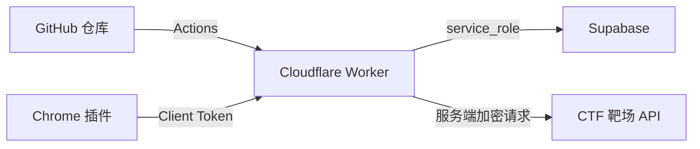

# txulog-lsy CTF 插件工作区

本仓库包含面向授权 CTF 隔离靶场的 Chrome MV3 插件、Cloudflare Worker 中间层和 CDP 验证脚本。当前主插件是「糖心志者」，用于验证游客账号侧的权限展示、完整账号池、完整播放链路、金币视频购买判断和远程账号池同步。

## 目录

```text
.
├── tangxin-zhizhe-extension/   # 糖心志者 Chrome 插件
├── txzz-worker/                # Cloudflare Worker + Supabase 远程账号池
├── hongyan-repro-extension/    # 糖心炮弹交易复现插件
├── verify_txzz_real_cdp.js     # 真实隔离靶场 CDP 验证脚本
├── verify_txzz_extension.js    # 本地 fixture 回归脚本
└── .github/workflows/          # GitHub Actions 部署 Worker
```

## 推荐部署方式



GitHub 只负责部署 Worker。敏感信息不要提交到仓库：

- Supabase `service_role`
- 完整权限账号密码
- 完整账号 token/deviceId
- 目标接口 AES key
- Worker admin/client token

这些值应放在 Cloudflare Worker Secrets 或 GitHub Secrets。

## 快速开始

1. 在 Supabase 执行 `txzz-worker/schema.sql`。
2. 在 Cloudflare/GitHub 配置 Worker 部署需要的 secret。
3. 部署 `txzz-worker`。
4. 调用 `/v1/accounts/seed` 写入默认完整账号池。
5. 在 Chrome 安装 `tangxin-zhizhe-extension`。
6. 在插件「账号池」页填写 Worker URL 和 Client Token，点击「保存远程配置」与「同步远程」。

详细文档：

- [糖心志者插件文档](./tangxin-zhizhe-extension/README.md)
- [Worker 部署文档](./txzz-worker/README.md)

## GitHub Actions

已提供：

```text
.github/workflows/deploy-txzz-worker.yml
```

GitHub 仓库 Secrets：

```text
CLOUDFLARE_API_TOKEN
CLOUDFLARE_ACCOUNT_ID
SUPABASE_URL
SUPABASE_SERVICE_ROLE_KEY
TXZZ_API_AES_KEY
TXZZ_CREDENTIAL_KEY
TXZZ_ADMIN_TOKEN
TXZZ_CLIENT_TOKEN
TXZZ_PROXY_SIGNING_KEY
TXZZ_SEED_ACCOUNTS_JSON
```

工作流当前绑定 `VITE_SUPABASE_URL` 环境，会先检查该环境下的必填 GitHub Secrets 是否存在，再通过 `wrangler deploy --secrets-file` 将代码和运行时密钥一起发布到 Cloudflare Worker。也可以本地通过 Wrangler 手动设置：

```powershell
cd .\txzz-worker
npx wrangler secret put SUPABASE_URL
npx wrangler secret put SUPABASE_SERVICE_ROLE_KEY
npx wrangler secret put TXZZ_API_AES_KEY
npx wrangler secret put TXZZ_CREDENTIAL_KEY
npx wrangler secret put TXZZ_ADMIN_TOKEN
npx wrangler secret put TXZZ_CLIENT_TOKEN
npx wrangler secret put TXZZ_SEED_ACCOUNTS_JSON
```

## 本地检查

```powershell
node --check .\txzz-worker\src\worker.js
node --check .\tangxin-zhizhe-extension\background.js
node --check .\tangxin-zhizhe-extension\content.js
node --check .\tangxin-zhizhe-extension\page_hook.js
node -e "JSON.parse(require('fs').readFileSync('.\\tangxin-zhizhe-extension\\manifest.json','utf8')); console.log('manifest ok')"
```

## 安全提醒

本项目只用于授权 CTF 隔离靶场。开源前请确认 `.dev.vars`、`evidence/`、浏览器 profile、截图、CDP 输出、账号密码、token/deviceId、Supabase key 都没有进入仓库。已经在聊天、日志或截图中出现过的密钥应立即轮换。

## 更新日志

2026-06-09 19:27 【优化】优化 GitHub Actions 部署流程，新增必填 GitHub Secrets 存在性检查；部署失败时可更快定位 Cloudflare 或 Supabase 相关密钥是否缺失，不影响 Worker 业务接口逻辑。
2026-06-09 19:39 【修复】修复 GitHub Actions 读取不到环境密钥的问题，部署任务显式绑定 `VITE_SUPABASE_URL` 环境，兼容当前已配置在环境下的 Worker 部署密钥。
2026-06-09 19:54 【修复】修复 Worker 发布后运行时密钥未注入的问题，GitHub Actions 改为使用 `wrangler deploy --secrets-file` 将代码和密钥随同版本一起发布，避免部署成功但线上环境变量为空。
