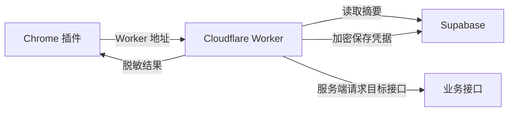

# 糖心志者云端服务仓库

本仓库用于部署「糖心志者」插件的云端服务，包含 Cloudflare Worker、Supabase 数据库脚本和 GitHub Actions 自动发布配置。

## 项目介绍

「糖心志者」插件需要一个服务端中间层来保护完整账号凭据、管理云端账号池、执行账号轮换并向插件返回脱敏后的账号摘要。当前仓库提供完整的 Worker 部署结构，适合直接推送到 GitHub 后通过 Actions 发布到 Cloudflare。

## 核心功能

- Cloudflare Worker 服务端接口
- Supabase 账号池读取和写入
- 完整账号凭据服务端加密保存
- 云端账号摘要返回
- 按金币数量升序的云端自动轮换模式
- 本地账号上传云端接口
- Worker 健康检查接口
- Worker 智能体检接口，可输出服务分数、分项检查和修复建议
- 插件侧体检结果记忆，设置页再次打开时可显示上次体检状态并支持清除历史记录
- GitHub Actions 自动部署
- 部署完成后输出 Worker 默认访问地址

## 环境要求

- Node.js `22.16.0` 及以上
- npm `10.0.0` 及以上
- Wrangler `4.98.0`
- Cloudflare 账号
- Supabase 项目
- GitHub 仓库

## 项目目录结构

```text
txzz-plugin-worker/
├── .github/
│   └── workflows/
│       └── deploy-txzz-worker.yml  # GitHub Actions 部署流程
├── txzz-worker/
│   ├── src/
│   │   └── worker.js               # Worker 主入口
│   ├── schema.sql                  # Supabase 表结构
│   ├── package.json                # Node 项目配置和固定依赖
│   ├── wrangler.toml               # Worker 发布配置
│   ├── .dev.vars.example           # 本地开发环境变量示例
│   └── README.md                   # Worker 详细开发和接口文档
├── wrangler.toml                   # 根级 Wrangler 兼容配置
├── .gitignore                      # 仓库忽略规则
└── README.md                       # 当前仓库说明
```

## 快速部署

### 第一步：安装依赖

```powershell
cd .\txzz-worker
npm install
npm run check
```

### 第二步：初始化 Supabase

1. 打开 Supabase 控制台。
2. 进入目标项目。
3. 打开 SQL Editor。
4. 复制 `txzz-worker/schema.sql` 全部内容。
5. 粘贴并执行。

### 第三步：配置 Cloudflare 密钥

```powershell
npx wrangler secret put SUPABASE_URL
npx wrangler secret put SUPABASE_SERVICE_ROLE_KEY
npx wrangler secret put TXZZ_API_AES_KEY
npx wrangler secret put TXZZ_CREDENTIAL_KEY
npx wrangler secret put TXZZ_PROXY_SIGNING_KEY
npx wrangler secret put TXZZ_SEED_ACCOUNTS_JSON
```

### 第四步：发布 Worker

```powershell
npm run deploy
```

部署完成后，使用 Worker 地址访问：

```text
https://<你的服务名>.<你的账号>.workers.dev/v1/health
```

## GitHub Actions 自动部署

仓库内置 `.github/workflows/deploy-txzz-worker.yml`。配置好 Secrets 后，推送代码即可自动部署。

需要在 GitHub 仓库 Secrets 中配置：

```text
CLOUDFLARE_API_TOKEN
CLOUDFLARE_ACCOUNT_ID
SUPABASE_URL
SUPABASE_SERVICE_ROLE_KEY
TXZZ_API_AES_KEY
TXZZ_CREDENTIAL_KEY
TXZZ_PROXY_SIGNING_KEY
TXZZ_SEED_ACCOUNTS_JSON
```

建议部署流程：

1. 将本仓库推送到 GitHub。
2. 打开仓库 `Settings`。
3. 进入 `Secrets and variables`。
4. 添加上方 Secrets。
5. 推送代码或手动运行 Actions。
6. 在 Actions Summary 中查看 Worker 地址。
7. 把 Worker 地址填写到「糖心志者」插件的账号池页面。

## 插件侧配置

打开「糖心志者」插件面板：

1. 进入「账号池」页。
2. 「云端服务地址」填写部署后的 Worker 地址。
3. 选择账号来源模式。
4. 点击「保存远程配置」。
5. 点击「同步远程」。
6. 本地账号可直接点击「上传云端」，不需要额外填写令牌。
7. 进入「设置」页点击「开始体检」，确认云端服务密钥、数据库和账号池状态正常。
8. 体检完成后可点击「复制报告」保存诊断结果，或点击「处理账号池」直接跳转到账号管理页面。
9. 再次打开设置页会显示当前 Worker 地址对应的「上次体检」，需要重新排查时可点击「开始体检」刷新，也可点击「清除上次体检」删除本地历史记录。

## 账号池数据流



## 本地开发

复制环境变量示例：

```powershell
Copy-Item .\txzz-worker\.dev.vars.example .\txzz-worker\.dev.vars
```

启动本地服务：

```powershell
cd .\txzz-worker
npm run dev
```

健康检查：

```powershell
Invoke-RestMethod http://127.0.0.1:8787/v1/health
```

## 常见问题排查

### 部署成功但接口提示缺少 SUPABASE_URL

1. 确认 Cloudflare Worker Secrets 中已经设置 `SUPABASE_URL`。
2. 如果使用 GitHub Actions，确认 GitHub Secrets 中也有 `SUPABASE_URL`。
3. 重新运行部署流程。
4. 访问 `/v1/health` 查看运行时密钥状态。

### 插件无法同步云端账号池

1. 确认 Worker 地址填写正确。
2. 确认 Supabase 已执行 `schema.sql`。
3. 确认 `SUPABASE_SERVICE_ROLE_KEY` 没有填错。
4. 访问 `/v1/health` 查看必填变量是否齐全。
5. 访问 `/v1/diagnostics` 或在插件设置页点击「开始体检」，根据分项建议排查。

### GitHub Actions 部署失败

1. 查看 Actions 日志中的缺失密钥提示。
2. 确认 `CLOUDFLARE_ACCOUNT_ID` 和 `CLOUDFLARE_API_TOKEN` 有效。
3. 确认 `wrangler.toml` 中的 Worker 名称没有冲突。
4. 本地运行 `npm run check` 排除语法错误。

## 安全与隐私

- 不要提交 `.dev.vars`。
- 不要提交 Supabase `service_role`。
- 不要提交完整账号密码、二维码凭证、token 或 deviceId。
- 不要在插件前端硬编码服务端管理密钥。
- 已经暴露过的密钥应立即轮换。
- 账号凭据应由 Worker 使用 `TXZZ_CREDENTIAL_KEY` 加密后保存。

## 版本说明

| 组件 | 版本 |
| --- | --- |
| Worker | `1.1.0` |
| Wrangler | `4.98.0` |
| Node.js | `22.16.0` 及以上 |

## 更新日志

2026-06-09 19:27 【优化】优化 GitHub Actions 部署流程，新增必填 GitHub Secrets 存在性检查。
2026-06-09 19:39 【修复】修复 GitHub Actions 读取不到环境密钥的问题，部署任务显式绑定指定环境。
2026-06-09 19:54 【修复】修复 Worker 发布后运行时密钥未注入的问题，GitHub Actions 改为使用 `wrangler deploy --secrets-file` 发布。
2026-06-09 20:15 【新增】GitHub Actions 新增默认 Worker 地址输出步骤，部署完成后在 Summary 中显示访问地址。
2026-06-09 21:35 【新增】新增客户端账号上传接口，支持插件把本地账号上传为云端加密凭证。
2026-06-12 23:36 【优化】重写仓库 README 为 GitHub 风格文档，补充部署流程、目录结构、插件配置、常见问题、安全说明和版本说明。
2026-06-13 00:27 【优化】简化插件侧远程账号池配置，取消普通同步和上传流程中的令牌填写要求；文档同步说明账号卡片会展示普通 VIP、尤物圈和金币余额。
2026-06-13 01:33 【优化】更新云端账号池说明，移除固定账号模式描述，改为按金币数量升序自动轮换；金币视频由 Worker 先检查购买状态，再从金币最少账号组中随机选择账号购买。
2026-06-13 01:45 【优化】云端账号摘要新增只读标记和远程账号标识，插件同步后可稳定识别云端账号并隐藏手动选择入口。
2026-07-07 23:33 【新增】补充 Worker 智能体检能力说明，插件配置文案统一为「云端服务地址」，新增 `/v1/diagnostics` 排查入口说明，并同步 Worker 版本到 `1.1.0`。
2026-07-07 23:48 【优化】补充插件体检快捷处理说明，体检完成后可复制诊断报告、同步账号池或直接跳转处理异常账号，方便部署排查与用户自助处理。
2026-07-07 23:53 【优化】补充插件侧上次体检记忆说明，设置页会按 Worker 地址保留最近一次云端服务体检状态并支持一键清除；服务端接口保持兼容不变。
