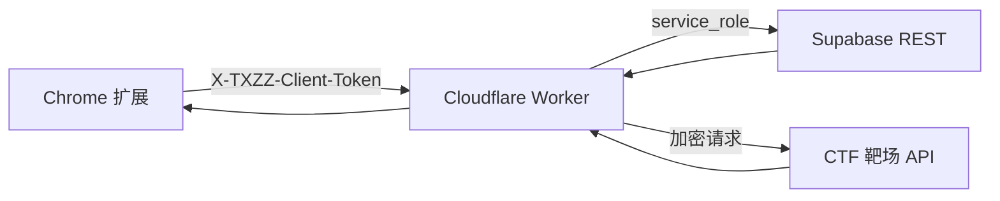

# 糖心志者远程账号池 Worker

这个目录是「糖心志者」插件的服务端中间层。插件只和 Cloudflare Worker 通信；完整权限账号、Supabase `service_role`、目标接口 AES key、账号池种子都放在 Worker Secrets 或 GitHub Secrets 里，避免出现在 Chrome 扩展前端代码中。

## 架构



Worker 负责：

- 从 Supabase 读取远程账号池，并只返回脱敏后的账号状态。
- 使用 `TXZZ_CREDENTIAL_KEY` 对完整账号凭据做 AES-GCM 加密后再写入 Supabase。
- 在服务端通过账号密码、已缓存 token 或二维码凭证恢复完整权限账号会话。
- 在服务端拉取 `/movie/detail`、按需执行金币视频购买，再把完整播放详情返回给插件。
- 缓存完整播放详情，减少重复登录和重复购买流程。

## Supabase 初始化

在 Supabase SQL Editor 执行：

```sql
-- 直接粘贴 txzz-worker/schema.sql 的内容执行
```

表结构：

- `txzz_accounts`：远程账号池，`secret_box` 为服务端加密后的凭据。
- `txzz_full_detail_cache`：完整视频详情缓存。
- `txzz_audit_logs`：账号验证、详情拉取、购买流程的审计记录。

RLS 已启用，且不创建 anon 读写策略。Worker 使用 `service_role` 访问。

## 本地配置

复制示例文件：

```powershell
Copy-Item .\txzz-worker\.dev.vars.example .\txzz-worker\.dev.vars
```

`.dev.vars` 仅用于本地测试，不要提交。字段含义：

```text
SUPABASE_URL=https://your-project.supabase.co
SUPABASE_SERVICE_ROLE_KEY=只放 Supabase service_role
TXZZ_API_AES_KEY=靶场前端接口 AES key
TXZZ_CREDENTIAL_KEY=随机高强度账号凭据加密口令
TXZZ_ADMIN_TOKEN=随机高强度管理令牌
TXZZ_CLIENT_TOKEN=随机高强度插件调用令牌
TXZZ_SEED_ACCOUNTS_JSON=[{"id":"full-lsyhook","label":"lsyhook 完整权限","username":"lsyhook","password":"完整权限账号密码"}]
```

生成随机令牌示例：

```powershell
node -e "console.log(crypto.randomUUID() + crypto.randomUUID())"
```

## 本地运行

```powershell
cd .\txzz-worker
npm install
npm run check
npm run dev
```

健康检查：

```powershell
Invoke-RestMethod http://127.0.0.1:8787/v1/health
```

种子账号写入 Supabase：

```powershell
Invoke-RestMethod `
  -Method Post `
  -Headers @{ "X-TXZZ-Admin-Token" = "<TXZZ_ADMIN_TOKEN>" } `
  -Uri http://127.0.0.1:8787/v1/accounts/seed
```

同步账号池：

```powershell
Invoke-RestMethod `
  -Headers @{ "X-TXZZ-Client-Token" = "<TXZZ_CLIENT_TOKEN>" } `
  -Uri http://127.0.0.1:8787/v1/accounts
```

上传二维码凭证账号：

```powershell
Invoke-RestMethod `
  -Method Post `
  -Headers @{ "X-TXZZ-Admin-Token" = "<TXZZ_ADMIN_TOKEN>" } `
  -ContentType "application/json; charset=utf-8" `
  -Body (@{
    account = @{
      id = "full-qr-自定义短编号"
      label = "QR credential 自定义短编号"
      qrcode = "<二维码解析出的凭证内容>"
      enabled = $true
      source = "qrcode"
      notes = "二维码凭证账号，Worker 服务端加密保存"
    }
  } | ConvertTo-Json -Depth 5) `
  -Uri http://127.0.0.1:8787/v1/accounts
```

二维码凭证会写入 `secret_box` 并由 Worker 使用 `TXZZ_CREDENTIAL_KEY` 加密。`GET /v1/accounts` 只返回 `hasQrcode` 等脱敏摘要，不返回凭证明文。

## GitHub 部署到 Cloudflare

仓库已包含 `.github/workflows/deploy-txzz-worker.yml`。推送 `main` 或 `master` 且修改 `txzz-worker/**` 时会自动部署，也可以手动运行 workflow。

GitHub 仓库 Secrets 需要配置：

```text
CLOUDFLARE_API_TOKEN
CLOUDFLARE_ACCOUNT_ID
SUPABASE_URL
SUPABASE_SERVICE_ROLE_KEY
TXZZ_API_AES_KEY
TXZZ_CREDENTIAL_KEY
TXZZ_ADMIN_TOKEN
TXZZ_CLIENT_TOKEN
TXZZ_PROXY_SIGNING_KEY
TXZZ_SEED_ACCOUNTS_JSON
```

工作流当前绑定 `VITE_SUPABASE_URL` 环境，会先检查该环境下的必填 GitHub Secrets 是否存在，再通过 `wrangler deploy --secrets-file` 将代码和运行时密钥一起发布到 Cloudflare Worker。Worker 配置已开启 `workers_dev = true`，部署后优先使用 Cloudflare 默认 `*.workers.dev` 域名；工作流会在 Summary 中输出完整默认 Worker 地址。GitHub 只负责触发部署，不提供可运行的 Worker 接口域名。也可以本地通过 Wrangler 手动设置：

```powershell
cd .\txzz-worker
npx wrangler secret put SUPABASE_URL
npx wrangler secret put SUPABASE_SERVICE_ROLE_KEY
npx wrangler secret put TXZZ_API_AES_KEY
npx wrangler secret put TXZZ_CREDENTIAL_KEY
npx wrangler secret put TXZZ_ADMIN_TOKEN
npx wrangler secret put TXZZ_CLIENT_TOKEN
npx wrangler secret put TXZZ_SEED_ACCOUNTS_JSON
```

然后部署：

```powershell
npx wrangler deploy
```

部署完成后先种子：

```powershell
Invoke-RestMethod `
  -Method Post `
  -Headers @{ "X-TXZZ-Admin-Token" = "<TXZZ_ADMIN_TOKEN>" } `
  -Uri https://<your-worker>.workers.dev/v1/accounts/seed
```

## 插件配置

打开「糖心志者」面板，进入「账号池」：

1. `Worker URL` 填 Worker 地址，当前默认使用 `https://txzzsecure.lsy20.top`。
2. `Client Token` 填 `TXZZ_CLIENT_TOKEN`。
3. `Admin Token` 只在需要从插件上传账号时填写；日常使用可以留空。
4. 点击「保存远程配置」和「同步远程」。

后续视频详情命中 `/movie/detail` 时，插件会优先调用：

```text
POST /v1/movie/full-detail
```

Worker 在服务端完成完整账号验证、完整详情获取和金币视频购买判断，插件端只接收可用于沙箱验证的详情结果。

账号轮换规则：

- `accountMode=cloud`：Worker 随机轮换云端账号；如果插件带了 `accountId`，该账号只作为优先尝试对象，失败后继续尝试其他启用账号。
- `accountMode=cloud-fixed`：Worker 只使用指定 `accountId`，适合固定测试某个云端账号。
- `accountMode=cloud-first`：插件优先使用云端，云端失败后再走本地兜底。
- 状态为 `error` 的云端账号不会参与默认随机轮换，避免旧密钥坏凭证反复阻塞播放链路；固定账号模式仍会返回明确错误，方便定位需要重新上传的账号。

## 接口

```text
GET  /v1/health
GET  /v1/accounts
POST /v1/accounts
POST /v1/accounts/client-upload
POST /v1/accounts/seed
POST /v1/accounts/verify
POST /v1/movie/full-detail
GET  /v1/media/proxy
```

鉴权：

- 插件读取和视频详情接口：`X-TXZZ-Client-Token`
- 本地账号上传云端接口：`X-TXZZ-Client-Token`
- 管理写入账号、种子、验证接口：`X-TXZZ-Admin-Token`

## 安全注意

- 已经在聊天、日志或截图里出现过的 Supabase `service_role` 和完整账号密码，都应视为泄露并轮换。
- 不要把 `.dev.vars`、`evidence/`、浏览器 profile、CDP 输出提交到 GitHub。
- 开源版本建议保留 Worker 远程模式，关闭或移除前端本地 fallback 里的真实靶场 AES key。
- 该项目只用于授权 CTF 隔离靶场，不用于真实站点、真实支付或非授权账号。

## 更新日志

2026-06-09 16:08 【新增】新增远程 Worker 二维码凭证账号恢复能力，账号池可保存 `qrcode` 凭证并在服务端通过 `/user/findQrcode` 获取完整权限会话；同步固定 Wrangler 依赖版本为 `4.98.0`，便于后续部署环境稳定复现。
2026-06-09 16:21 【修复】优化云端账号轮换策略，非固定模式下选中账号只作为优先尝试对象，失败后继续轮换其他启用账号；新增 `cloud-fixed` 固定账号模式，便于固定测试指定云端账号。
2026-06-09 19:27 【优化】优化 GitHub Actions 部署流程，新增必填 GitHub Secrets 存在性检查；部署失败时可更快定位 Cloudflare 或 Supabase 相关密钥是否缺失，不影响 Worker 业务接口逻辑。
2026-06-09 19:39 【修复】修复 GitHub Actions 读取不到环境密钥的问题，部署任务显式绑定 `VITE_SUPABASE_URL` 环境，兼容当前已配置在环境下的 Worker 部署密钥。
2026-06-09 19:47 【新增】新增 `/v1/health` 运行时诊断字段，返回构建标识和必填密钥存在状态，便于排查自定义域名是否指向最新 Worker 以及运行时密钥是否注入成功；诊断结果不返回任何密钥明文。
2026-06-09 19:54 【修复】修复 Worker 发布后运行时密钥未注入的问题，GitHub Actions 改为使用 `wrangler deploy --secrets-file` 将代码和密钥随同版本一起发布，避免部署成功但线上环境变量为空。
2026-06-09 20:00 【优化】启用 Cloudflare Worker 默认 `workers.dev` 部署域名，文档明确 GitHub 只负责部署触发，插件远程地址应优先填写默认 Worker 域名而不是自定义域名。
2026-06-09 20:15 【新增】GitHub Actions 新增默认 Worker 地址输出步骤，部署完成后自动在 Summary 中显示 `workers.dev` 完整访问地址，方便直接复制到插件远程配置。
2026-06-09 20:22 【修复】默认 Worker 地址输出步骤改为非阻断执行，并优先从 Wrangler 部署输出中解析 `workers.dev` 地址，避免地址查询失败导致整体部署显示失败。
2026-06-09 20:28 【修复】修复默认 Worker 地址输出脚本中 `require` 与顶层 `await` 混用导致的 Node 模块格式冲突，脚本改为异步函数包裹执行。
2026-06-09 21:35 【新增】新增 `/v1/accounts/client-upload` 客户端上传接口，插件可将本地完整账号上传为云端加密凭证；同时默认轮换跳过 `error` 状态账号，坏二维码凭证不会阻塞其他云端账号。
